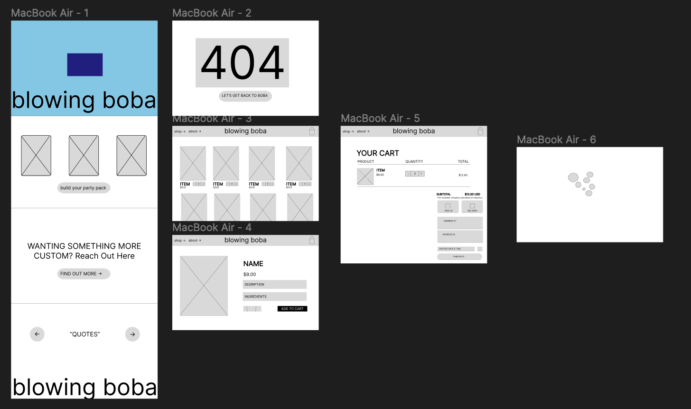

# BLOWING BOBA

This template provides a minimal setup to get React working in Vite with HMR and some ESLint rules.

## Wireframes

    USER PAGE

    This image includes the layout wireframes for the cusotmer frontend portion of the application. This includes a home, loading, 404, cart, and more. I tried to ensure that there was a fun but easy navigation of the page while designing this portion of the website.

Official Plugins:

- [@vitejs/plugin-react](https://github.com/vitejs/vite-plugin-react/blob/main/packages/plugin-react/README.md) uses [Babel](https://babeljs.io/) for Fast Refresh
- [@vitejs/plugin-react-swc](https://github.com/vitejs/vite-plugin-react-swc) uses [SWC](https://swc.rs/) for Fast Refresh
# blowing-boba-vite
